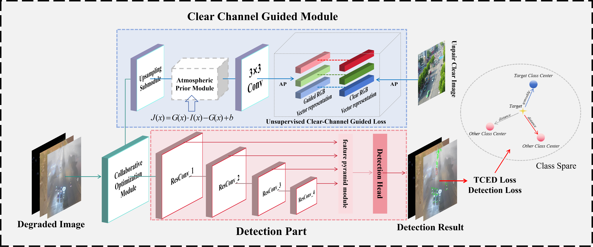

## Degradation-Aware Aerial Object Detection Framework:Efficient Network Design and Multi-Degradation Dataset

## Abstract

## PipLine
 

## Project Introduction
The project is based on the [Diffusiondet](https://github.com/ShoufaChen/DiffusionDet) and [detectron2](https://github.com/facebookresearch/detectron2), maintaining the overall framework unchanged. For specific usage, you can refer to the [detectron2 documentation](https://detectron2.readthedocs.io/en/latest/).
## Datasets
We provided the download links for the Multi-Degradation Aerial Detection Dataset(MDADD) mentioned in the work. The download links are as follows:
 https://pan.baidu.com/s/1JKQvNdOp8ngSa87k0QosRg?pwd=epb2

